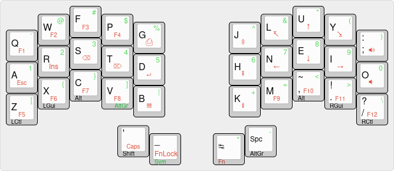

# Kolibri

Kolobri is a keymap for small ergonomic/split keyboards with 3x5 keys and 2 thumb keys per hand. It is inspired by the elegance and conceptual clarity of Miryoku by Manna Harbour, but is designed from first principles with its own design choices and trade-offs.

It is designed to be fully functional, comfortable to use, easy to learn and well suited for fast typing and programming. Major highlights are:

* Shift, AltGr and layer keys on thumbs
* Space, Tab, '_' and Apostrophe on thumbs
* Bottom-row mod-taps for remaining modifiers
* Per-key mod-tap configuration to favour "tap" on fingers and Space, "hold" on other thumb keys
* Non-AltGr letters, symbols and numbers accessible with at most one modifier (either Shift or Symbol layer key)
* Most frequent keys on the home row: numbers, arrows, editing, Esc
* Function layer can be locked
* Options for left or right-handed thumb clusters and Function layers

## About the Name

Kolibri was the brand of the first typewriter I ever used as a kid, even before I had a computer. It was an elegant and well-built mechanical typewriter with a low profile, that came in its own faux-leather carrying case for luggability. You can read more about it on [typewriterreview.com](https://typewriterreview.com/2015/11/19/groma-kolibri/). Kolibri is also the German word for hummingbird. That makes it a fitting name for a keymap designed for small keyboards.

# Motivation and Concepts

The goal is to design a keyboard layout for small ergonomic/split keyboards that is comfortable, fully functional, suitable for programming, supports AltGr for international layouts, enables fast typing, and is easy to remember and learn.

The 3x5 form factor with 3 thumb keys per hand is favoured by many for ergonomics, with all keys within easy reach of their fingers and thumbs. It turns out that a fully functional keyboard is possible even with only 2 thumb keys. A layout that fits that size can be expanded to fit almost any keyboard.

For full functionality and comfort, all combinations of modifiers (Shift, Ctrl, Alt, Gui) plus any key should be possible to type without contorting the hands. The thumbs can only hold two modifiers at the same time. When one thumb is holding down a layer switching key, only one additional thumb-modifier is possible. Therefore most modifiers have to be assigned to fingers, with no more than one modifier per finger. The only way to do that on a 3x5 layout, without preventing fast typing, is with mod-tap, where the same key has two different functions when it is held or tapped. Modifier keys must be duplicated on both hands to avoid contortions and to make modifying any key possible.

My experiments with mod-taps on the home row were not encouraging. Especially with Shift as a mod-tap on a home-row key, there is frequent ambiguity between mod+tap or tap+tap that can hurt typing flow. Moving mod-taps to less frequently used bottom-row keys helps. Moving Shift to a thumb key further makes it possible to configure mod-tap per-key to unambiguously favour "tap" on fingers and Space, and "hold" on other thumb keys, including Shift and layer keys.

Shift and AltGr are conceptually layer switching keys. Placing them both on thumb keys along with actual layer switching keys emphasizes this idea while minimizing the use of problematic mod-tap keys in the main typing area.

# Design Choices and Constraints

* 3x5 with 2 thumb keys per hand
* Shift, AltGr and layer keys on the thumbs
* Bottom-row mods for Ctrl, Gui, Alt
* Space and Tab on thumbs on the base layer
* Only one Space and one Shift key
* Use home row for most frequent keys on layers: editing, navigation, numbers
* Esc on the home row for use in Vim

With Shift and AltGr on thumb keys, there are not enough thumb keys left for many Miryoku-style one-handed layers. Therefore this keymap uses fewer layers, which span both hands. That means, mod-tap modifiers are needed on both hands on all layers to allow all modifier+key combinations.

It also means that thumb+finger key on the same hand is a common occurrence with this keymap with all Shift, AltGr and layer keys.

Shift and AltGr must be on opposite thumbs to allow them to be combined. Space and Tab on the base layer must be modifiable with Shift.

Right-handed users would place Shift on the left thumb so it can be used as a modifier with the mouse. Left-handed users with a left-hand mouse would place Shift on the right thumb. Consequently, Space and Tab will be on the thumb of the other (the dominant) hand. The layer descriptions below assume right-handedness. However, a version with flipped thumb-cluster is available for left-handed users.

Layers can only use one of Shift or AltGr, but not both, because one thumb is already holding the layer switching key. The Number+Symbol layer can be designed to work without Shift, so it can use AltGr. This has the added benefit that all symbols that don't need AltGr, are reachable with a single modifier, either Shift or the layer key.

Navigation+Function and (optional) Mouse layers need Shift (e.g. for highlighting text) but don't need AltGr.

Mod-tap keys require two presses in quick succession to enable key-repeat. Therefore keys that are frequently used with key-repeat, such as arrow keys, should not be placed on bottom-row modifier keys.

# Layer Design

The basic keyboard functionality is on three layers: Base (e.g. Colemak or QWERTY), num+sym, nav+fn. A fourth layer adds keyboard control (backlight, reset, etc.), media keys and macros.

Combining the two layer switching keys can reach the ctrl+macro layer. An optional mouse layer can be enabled via the locked nav+fn layer (see below).

Ctrl, Gui and Alt modifiers are consistent across all layers, in the outer columns of the bottom row.

## Base Layer

```
   Top row tap:   Q   W   F   P   G              J   L   U   Y   ;:
  Home row tap:   A   R   S   T   D              H   N   E   I   O
Bottom row tap:   Z   X   C   V   B              K   M   ,~  .!  /?
Bottom row hold: Ctl Gui Alt                            Alt Gui Ctl
     Thumb tap:                   '   _     Tab Spc
     Thumb hold:                Shft Sym    Fn AltGr
```

For right-handed users, Shift is on the left, AltGr on the right. This choice dictates much of the rest of the thumb cluster layout. It means, the left thumb activates the num+fn layer that needs AltGr, and the right thumb activates the nav+fn layer that needs Shift. Space and Tab are on the right thumb and can be combined with Shift. Shift and Space, the most common thumb keys, are on the home positions of the thumbs.

Holding Space is AltGr. Since AltGr is less frequently used, it doesn't hurt that this key prefers the "tap" action. Tab is the "tap" action on the Fn layer key.

Two symbols do not fit in the num+sym layer and need to move to the left thumb on the base layer. Apostrophe and '\_' are a convenient choice for typing and programming respectively. Apostrophe is placed on the Shift key to avoid the thumb jumping when typing "I'm". '\_' is on the num+sym layer key, which forces the thumb to jump when typing "UPPER_CASE_MACRO" names and avoids accidentally activating a tap+hold of '\_' instead of holding the layer key.

The shifted symbols of ',' and '.' are normally '<' and '>'. They are moved to the num+sym layer to avoid the thumbs jumping between Shift and Sym for common bigrams such as '->' and '=>'. They are replaced on the base layer with '~' and '!' by sending different keycodes when Shift is active.

Num+Sym Layer
-------------

```
   Top row tap:   `   @   #   $   %              ^   &   *   (   )
  Home row tap:   1   2   3   4   5              6   7   8   9   0
Bottom row tap:   [   {   }   ]   |              +   =   <   >   \
Bottom row hold: Ctl Gui Alt AGr                        Alt Gui Ctl
     Thumb tap:                  ___ ___     "   -
     Thumb hold:                            C+M AGr
```

This layer works without the Shift key. Numbers are on the home row. The corresponding shifted number symbols are in the upper row (except '!', which is replacing '>' on the base layer).

'<' and '>' keep their normal positions, so the only thing that changes is the "Shift" key used to activate them. Backslash takes the place of Slash. Plus and Equals take the remaining right-hand bottom-row keys.

The left bottom row has brackets, curly braces and Pipe. The nested arrangement of the brackets around the curly braces makes the "[]" bigram easier to type than having the closed bracket on the ring finger.

The right thumb types double quotes and '-'. Since '-' is often surrounded by Space, it uses the same key as Space. That way the right thumb doesn't need to jump when typing such sequences. A second AltGr mod-tap key is added in the left bottom row to allow modifying the two symbols on the right thumb.

## Nav+Fn Layer

```
   Top row tap:   F1  F2  F3  F4 PScr          SLck Home ↑  End Vol+
  Home row tap:  Esc Ins  ⌫   ⌦   ↲            PgUp  ←   ↓   →  Vol-
Bottom row tap:   F5  F6  F7  F8 Menu          PgDn  F9 F10 F11 F12
Bottom row hold: Ctl Gui Alt                            Alt Gui Ctl
     Thumb tap:                 Caps FnLk   ___ ___
     Thumb hold:                Shft C+M
     Thumb hold with FnLk:           Sym        Mouse
```

The nav+fn layer has an inverted-T arrow key cluster in the home position of the right hand. Home and End keys are left and right of the Up key. PageUp/Down are on the inner index-finger column, where there are no mod-taps affecting key-repeat. Like on a normal keyboard, the arrow keys can be used one-handed.

The left home row has Esc, Insert, Backspace, Delete, Enter, with Backspace and Delete on the strongest fingers. Enter is a little harder to reach on the inner column to avoid hitting it accidentally.

The F-keys are arranged in groups of four: F1-F4 in top-left, F5-F8 in bottom-left, F9-F12 in bottom-right. The remaing spots are filled up with PrintScreen, ScrollLock, and media volume control.

Tapping the Shift key on this layer toggles CapsLock.

The Nav+Fn layer can be locked with the FnLk key. Tapping the same key again unlocks the layer. FnLk can reduce strain and free up the right thumbs to type Space and Tab while editing or fixing indentation. The locked Nav+Fn layer is below the Num+Sym layer, so the Sym key still works on this layer. Holding the Fn key while the Nav+Fn layer is locked allows typing text without unlocking Nav+Fn. This is analogous to using Shift while CapsLock is enabled.

The AltGr function is replaced by a Mouse layer key if mouse keys are enabled.

## Alternative Nav+Fn Layers (TODO)

```
   Top row tap:   F1  F2  F3  F4 PScr          SLck Hom PDn PUp End
  Home row tap:  Esc Ins  ⌫   ⌦   ↲            Vol+  ←   ↓   ↑   →
Bottom row tap:   F5  F6  F7  F8 Menu          Vol-  F9 F10 F11 F12
Bottom row hold: Ctl Gui Alt                            Alt Gui Ctl
     Thumb tap:                 Caps FnLk   ___ ___
     Thumb hold:                Shft C+M
     Thumb hold with FnLk:           Sym        Mouse
```

An alternative navigation layer puts all the arrow keys in the home row, and paging, home and end keys in the upper row. This may have ergonomic benefits but requires more changes to muscle memory for anyone not used to Vi-style arrow keys.

Arrow keys on the right hand enable one-handed navigation or lazy browsing with only one hand on the keyboard. Some users may prefer the arrow keys in the left hand to reduce strain from holding the layer key with the same thumb. That would move the editing keys and Esc to the right instead. This variant can be combined with either of the arrow-key layouts.

## Ctrl+Macro Layer

I use this layer for RGB underglow control, QMK Reset and Debug functions, as well as a few macros of frequently typed text. It would also have space for many more media keys I never use.

TODO: Formalize definition and reserve space for user-defined macros

## Mouse Layer

The right hand is used for mouse movement (inverted-T cluster) and left-right scrolling. The left hand has the scroll wheel and mouse buttons. The "left" mouse button is on the index-finger, "middle" and "right" button on the ring finger. Button 4 and 5 are on the pinky. Having the "left" button on the left index finger allows dragging while holding the button and any additional modifiers.

The thumb keys have Shift and one key to control mouse acceleration.

# Support for other layouts and languages (TODO)

Kolibri works best for US-English QWERTY and Colemak layouts where the OS keymap is set to US-English or an International layout with extra symbols on an AltGr layer.

Using Dvorak would require small changes to some symbol key positions since quotes would end up on the left pinky instead of thumb keys. Or Quotes could keep their Kolibri positions on the thumb keys and the left pinky gets ';:' instead.

Native support for other languages would require tweaks to the base and symbol layers. ISO keyboard layouts have one more key. To fit that, one key would need to move to the Nav+Fn layer.

# QMK hacks

## Per-Key Mod-Tap Configuration

I configure mod-tap and layer-tap to prefer "tap" on the base layer finger keys and Space with `PERMISSIVE_HOLD` to allow fast key combos within the tapping term, but only if the modifier is held until after the tap-key is released.

Other keys prefer "hold" with `HOLD_ON_OTHER_KEY`. This includes mod-tap keys on layers. I got random results pressing a layer-tap key with a mod-tap key on a layer when the hold-configuration of the two keys disagreed. Making all the mod-taps on the layers `HOLD_ON_OTHER_KEY` to agree with the layer-tap resulted in more predictable behaviour.

## Mod-Tap with Shifted Symbols

Mod-Tap only works with 8-bit keycodes. Extended keycodes that apply a modifier (e.g. Shift for upper case letters) don't work with it out of the box. The QMK documentation suggests a [workaround that intercepts `process_record_user` and sends 16 bit keycodes with `tap_code16`](https://docs.qmk.fm/#/mod_tap?id=intercepting-mod-taps). I modified this idea to use the proper `register_code16` and `unregister_code16` calls to fix that problem.

## Moving '<' and '>' to the Num+Sym layer

This is done with a small hack in `process_record_user` that sends different keycodes when `KC_COMM` or `KC_DOT` are pressed with Shift held.

## Nav+Fn layer lock

The locked layer is mostly a copy of the normal layer but with different thumb-key assignments. This allows overriding the locked Nav+Fn layer with Num+Sym or a base-override layer. And it keeps the key combination to get to the Ctl+Macro layer consistent in all cases.

I cannot simply use `TG(L_NAV_FN_LOCKED)` because that's a 16-bit key code that doesn't work with `MT` or `LT`. I hijacked an unused 8-bit keycode for this and process it myself in `process_record_user`.

# LICENSE
Copyright 2022 Felix Kuehling <felix.kuehling@gmail.com>

This program is free software: you can redistribute it and/or modify
it under the terms of the GNU General Public License as published by
the Free Software Foundation, either version 2 of the License, or
(at your option) any later version.

This program is distributed in the hope that it will be useful,
but WITHOUT ANY WARRANTY; without even the implied warranty of
MERCHANTABILITY or FITNESS FOR A PARTICULAR PURPOSE.  See the
GNU General Public License for more details.

You should have received a copy of the GNU General Public License
along with this program.  If not, see <http://www.gnu.org/licenses/>.
